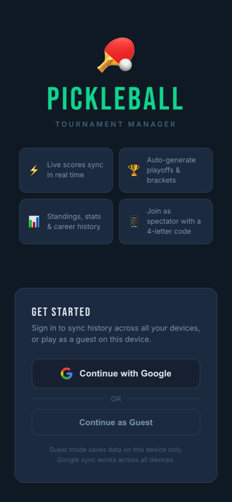

# Raja

**Full-Stack Developer · I build real-time web apps**

I build full-stack products end to end, from database schema and API design to the UI, tests and deployment. I'm most interested in software people use together in real time: collaborative editors, live scoreboards and team workspaces. I care about shipping things that are secure, tested and actually running in production.

## Featured work

<table>
  <tr>
    <td width="32%" valign="top" align="center">
      
    </td>
    <td valign="top">
      <h3><a href="https://github.com/iamrajac/Pickleball">Pickleball</a> · real-time tournament manager</h3>
      
Replaces paper scoresheets for my group's pickleball sessions: every score syncs live to every phone at the court.

      <ul>
        <li><b>Live sync</b> across all devices with Firebase Realtime Database: spectators join with a code or link, with a live viewer count and offline detection</li>
        <li><b>Fair scheduling</b> for 4–20 players: round-robin that prioritises new partners and opponents, rotating byes for odd counts, and playoff brackets chosen automatically by player count</li>
        <li><b>Player profiles</b> with Google Sign-In, career stats, badges, head-to-head records and clubs</li>
        <li><b>Access control</b> for creators, scorers (PIN), spectators and guests; installable as an app (PWA) with push notifications</li>
      </ul>
      <code>React</code> <code>Vite</code> <code>Firebase</code> <code>Firestore</code> <code>Cloud Functions</code> <code>PWA</code>
        <a href="https://pickleball-eosin.vercel.app"><b>Live app</b></a> · <a href="https://github.com/iamrajac/Pickleball">Code</a>
    </td>
  </tr>
</table>

<table>
  <tr>
    <td width="50%" valign="top">
      <h3><a href="https://github.com/iamrajac/NoteVault">NoteVault</a></h3>
      Collaborative workspace for teams. Notes are co-edited in real time with <b>Yjs CRDTs over Socket.IO</b>, go through an approval workflow with version history, and turn into tasks and milestones. Role-based access, email invites, <b>36 automated tests</b> and CI on every push.
        
      <code>Next.js</code> <code>TypeScript</code> <code>Express</code> <code>Socket.IO</code> <code>Prisma</code> <code>MySQL</code>
       <a href="https://notevault-dev.vercel.app"><b>Live demo</b></a> · <a href="https://github.com/iamrajac/NoteVault">Code</a>
    </td>
    <td width="50%" valign="top">
      <h3><a href="https://github.com/iamrajac/PHaRMIS">PHaRMIS</a></h3>
      Personal health monitoring app. Users track their health details, see their trends in charts and get AI-driven insights, all without needing a doctor or admin in the loop.
        
      <code>TypeScript</code> <code>React</code> <code>Node.js</code>
       <a href="https://p-ha-rmis.vercel.app"><b>Live demo</b></a> · <a href="https://github.com/iamrajac/PHaRMIS">Code</a>
    </td>
  </tr>
</table>

## Tech

  

Also: Socket.IO, WebSockets and CRDTs (Yjs), REST API design, JWT auth, automated testing, CI/CD.

## GitHub activity

  
  

---

**Looking for a full-time full-stack role.** If you're building something people use together, [let's talk](mailto:rajasreddy.chintha@gmail.com).

