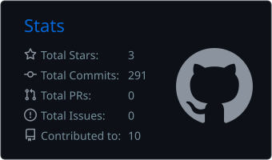
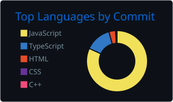

# Raja

**Full-Stack Developer · I build real-time web apps**

I build full-stack products end to end, from database schema and API design to the UI, tests and deployment. I'm most interested in software people use together in real time: collaborative editors, live scoreboards and team workspaces. I care about shipping things that are secure, tested and actually running in production.

## Featured work

<table>
  <tr>
    <td colspan="3">
      <h3><a href="https://github.com/iamrajac/NoteVault">NoteVault</a> · collaborative workspace for teams</h3>
      
      <ul>
        <li>Real-time co-editing of notes with <b>Yjs CRDTs over Socket.IO</b>, so simultaneous edits merge without conflicts</li>
        <li>Approval workflow with version history, tasks, milestones, notifications and role-based access for Admins, Team Leads and Employees</li>
        <li>JWT auth with server-side permission checks, rate limiting, one-time email links for invites and password resets</li>
        <li><b>36 automated integration tests</b> against a real MySQL, CI on every push, deployed on Vercel + Render + MySQL</li>
      </ul>
      <code>Next.js</code> <code>TypeScript</code> <code>Express</code> <code>Socket.IO</code> <code>Yjs</code> <code>Prisma</code> <code>MySQL</code>
      &nbsp;·&nbsp; <a href="https://notevault-dev.vercel.app"><b>Live demo</b></a> · <a href="https://github.com/iamrajac/NoteVault">Code</a>
    </td>
  </tr>
  <tr>
    <td width="33%" valign="top">
      <h4><a href="https://github.com/iamrajac/Pickleball">Pickleball</a></h4>
      Real-time tournament manager: round-robin scheduling, live score sync, playoffs, career stats, clubs and head-to-head analytics. Installable as an app.
        
      <code>React</code> <code>Firebase</code> <code>PWA</code>
       <a href="https://pickleball-eosin.vercel.app">Live demo</a> · <a href="https://github.com/iamrajac/Pickleball">Code</a>
    </td>
    <td width="33%" valign="top">
      <h4><a href="https://github.com/iamrajac/distributed-job-scheduler">Distributed Job Scheduler</a></h4>
      Job queue platform: workers atomically claim jobs, with retry and backoff strategies, a dead-letter queue, REST APIs and a monitoring dashboard.
        
      <code>TypeScript</code> <code>Prisma</code> <code>PostgreSQL</code>
       <a href="https://github.com/iamrajac/distributed-job-scheduler">Code</a>
    </td>
    <td width="33%" valign="top">
      <h4><a href="https://github.com/iamrajac/PHaRMIS">PHaRMIS</a></h4>
      Personal health monitoring: users track their health details, see trends in charts and get AI-driven insights.
        
      <code>TypeScript</code> <code>React</code> <code>Node.js</code>
       <a href="https://p-ha-rmis.vercel.app">Live demo</a> · <a href="https://github.com/iamrajac/PHaRMIS">Code</a>
    </td>
  </tr>
</table>

## Tech

  

Also: Socket.IO, WebSockets and CRDTs (Yjs), REST API design, JWT auth, automated testing, CI/CD.

## GitHub activity

  
  

---

**Looking for a full-time full-stack role.** If you're building something people use together, [let's talk](mailto:rajasreddy.chintha@gmail.com).

